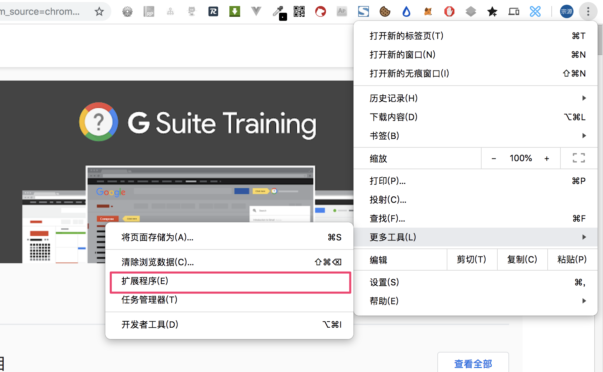
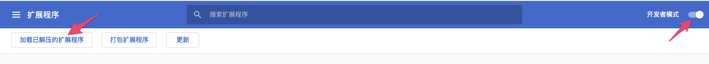
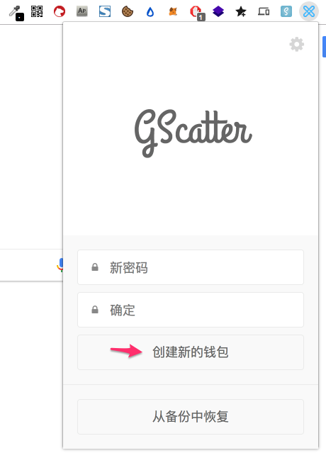
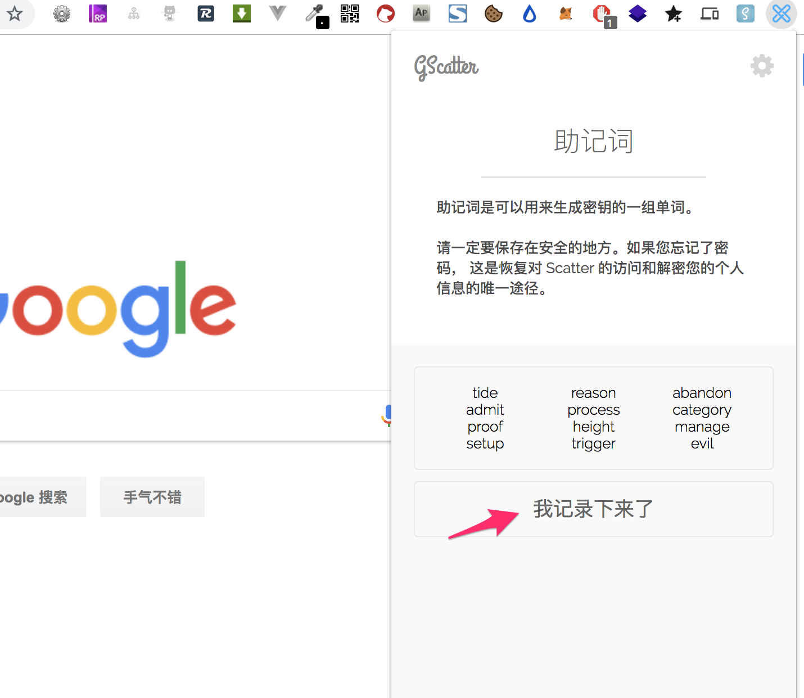
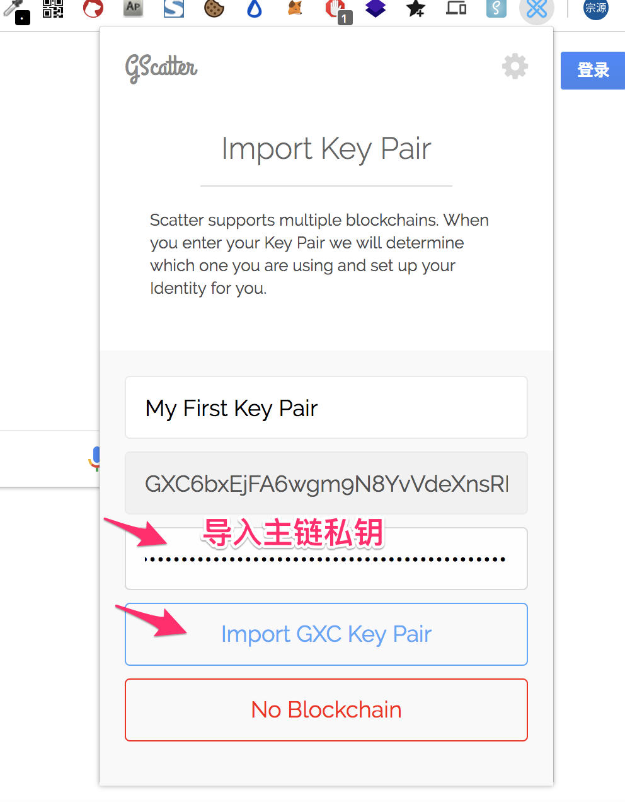

## 安装指南

请在chrome应用商店安装[最新插件](https://chrome.google.com/webstore/detail/gxc-wallet/pkghkgabkmdkdaoglpemmkooeikdopca)，如果您无法安装，可尝试以下步骤安装，但是这种方式不能提供更新，需要您自己关注版本更新。

1.点击 [这里](https://github.com/gxchain/GScatter/raw/master/gxc_wallet.zip) 下载最新版本的 `gxc_wallet.zip`

2.到chrome 扩展程序页面：

3.安装

打开开发者模式，然后解压步骤一下载的`gxc_wallet.zip`，点击 加载已解压的扩展程序 ，选择解压后的 `gxc_wallet`文件夹完成安装。

4.成功

可以在插件栏看到gxc_wallet插件啦

## 使用指南

1.打开插件，输入密码，创建新钱包：

2.记录助记词，以便忘记密码后的恢复：

3.导入主链私钥

导入后GXC Wallet会帮你创建一个身份，然后就可以开始使用GXC Wallet浏览器扩展啦
